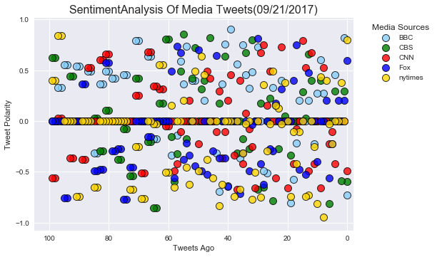
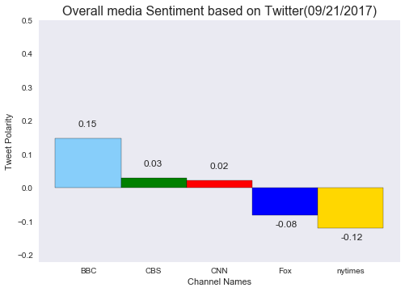

# News Mood 
<!--In this assignment, I created a Python script to perform a sentiment analysis of the Twitter activity of various news oulets, and to present  my findings visually.-->

# Observed trends: 
####  In the  Overall media sentiment based on twitter plot the BBC channel have more postive tweets   than others
#### Nytimes have the more negative tweets than others.
#### CBS channel is in neutral  position.


```python
# Dependencies
#import os
import tweepy
import pandas as pd
import json
import seaborn as sns
import numpy as np
import matplotlib.patches as mpatches
import matplotlib.pyplot as plt
from datetime import datetime 

# Import and Initialize Sentiment Analyzer
from vaderSentiment.vaderSentiment import SentimentIntensityAnalyzer
analyzer = SentimentIntensityAnalyzer()

# Twitter API Keys
consumer_key = "NDia3lgb7QR258CMpk5hWh1Ff"
consumer_secret = "5gXd49SjH3fihwoBLNCp6KYybCwOQSPvnWBnOwTRiu7jiIrInO"
access_token = "907734478159826946-0xIx20UVDhVxdEtWuyzvMX9az0rg2V5"
access_token_secret = "sNW0efMBw7QsqcFCJVbH0r5iZ7ucd1ovcP7QHhoAO1CRC"

# Setup Tweepy API Authentication
auth = tweepy.OAuthHandler(consumer_key, consumer_secret)
auth.set_access_token(access_token, access_token_secret)
api = tweepy.API(auth, parser=tweepy.parsers.JSONParser())

```


```python

   
total_data=[]
time=[]
Labels=("BBC", "CBS", "CNN", "Fox","nytimes")
target_channels=("BBC", "CBSNews", "CNN", "FoxNews","nytimes")
# Array to hold sentiment
sentiment_array = []
# Variable for holding the oldest tweet
oldest_tweet = ""
# Loop through all target users
for i in range(len(target_channels)):
    for x in range(5):
           
            public_tweets = api.user_timeline(target_channels[i], page=x )
            
            # Loop through all tweets
            for tweet in public_tweets:
                #print(json.dumps(tweet,indent=2))
                #print(tweet)
                polarity_scores = analyzer.polarity_scores(tweet["text"])
                sentiment = { "Text":tweet["text"],
                              "User": Labels[i],
                             "Compound":polarity_scores["compound"],
                              "Positive":polarity_scores["pos"],
                               "Neutral":polarity_scores["neu"],
                               "Negative":polarity_scores["neg"],
                              "time":datetime.strptime(tweet["created_at"], "%a %b %d %H:%M:%S %z %Y")}
                sentiment_array.append(sentiment)
                # Print the Sentiments
               # print(sentiment)
               # print("")
                #df.to_csv(file_name, encoding='utf-8', index=False)
twitter_df=pd.DataFrame(sentiment_array,index=None)

twitter_df.to_csv("TwitterFile.csv",sep='\t',index=False)

twitter_df
```


<div>
<style>
    .dataframe thead tr:only-child th {
        text-align: right;
    }

    .dataframe thead th {
        text-align: left;
    }

    .dataframe tbody tr th {
        vertical-align: top;
    }
</style>
<table border="1" class="dataframe">
  <thead>
    <tr style="text-align: right;">
      <th></th>
      <th>Compound</th>
      <th>Negative</th>
      <th>Neutral</th>
      <th>Positive</th>
      <th>Text</th>
      <th>User</th>
      <th>time</th>
    </tr>
  </thead>
  <tbody>
    <tr>
      <th>0</th>
      <td>0.0000</td>
      <td>0.000</td>
      <td>1.000</td>
      <td>0.000</td>
      <td>If you thought all wines were simply fermented...</td>
      <td>BBC</td>
      <td>2017-09-21 17:30:06+00:00</td>
    </tr>
    <tr>
      <th>1</th>
      <td>0.3327</td>
      <td>0.000</td>
      <td>0.894</td>
      <td>0.106</td>
      <td>Two new #Banksy pieces have appeared in London...</td>
      <td>BBC</td>
      <td>2017-09-21 16:52:02+00:00</td>
    </tr>
    <tr>
      <th>2</th>
      <td>0.5562</td>
      <td>0.000</td>
      <td>0.805</td>
      <td>0.195</td>
      <td>RT @BBCRadio2: 🎸@JoWhiley gets the scoop on ho...</td>
      <td>BBC</td>
      <td>2017-09-21 16:45:13+00:00</td>
    </tr>
    <tr>
      <th>3</th>
      <td>0.0000</td>
      <td>0.000</td>
      <td>1.000</td>
      <td>0.000</td>
      <td>🏯 This is how you move a 135-year-old Buddhist...</td>
      <td>BBC</td>
      <td>2017-09-21 16:32:04+00:00</td>
    </tr>
    <tr>
      <th>4</th>
      <td>0.5399</td>
      <td>0.000</td>
      <td>0.812</td>
      <td>0.188</td>
      <td>📸 For @BBCRadio2's 50th, @BryanAdams (Yep THE ...</td>
      <td>BBC</td>
      <td>2017-09-21 16:23:11+00:00</td>
    </tr>
    <tr>
      <th>5</th>
      <td>0.0000</td>
      <td>0.000</td>
      <td>1.000</td>
      <td>0.000</td>
      <td>#1XtraLive is coming! Take a look at the line ...</td>
      <td>BBC</td>
      <td>2017-09-21 16:05:02+00:00</td>
    </tr>
    <tr>
      <th>6</th>
      <td>0.4939</td>
      <td>0.000</td>
      <td>0.849</td>
      <td>0.151</td>
      <td>12 years after she was diagnosed with Alzheime...</td>
      <td>BBC</td>
      <td>2017-09-21 15:02:03+00:00</td>
    </tr>
    <tr>
      <th>7</th>
      <td>-0.3182</td>
      <td>0.141</td>
      <td>0.859</td>
      <td>0.000</td>
      <td>Recognise any of these faces? @GLA_Airport are...</td>
      <td>BBC</td>
      <td>2017-09-21 14:02:01+00:00</td>
    </tr>
    <tr>
      <th>8</th>
      <td>0.3612</td>
      <td>0.000</td>
      <td>0.872</td>
      <td>0.128</td>
      <td>Motorists are being encouraged to throw rubbis...</td>
      <td>BBC</td>
      <td>2017-09-21 13:03:02+00:00</td>
    </tr>
    <tr>
      <th>9</th>
      <td>0.4939</td>
      <td>0.000</td>
      <td>0.814</td>
      <td>0.186</td>
      <td>RT @BBCTwo: What do these remote tribes think ...</td>
      <td>BBC</td>
      <td>2017-09-21 12:50:41+00:00</td>
    </tr>
    <tr>
      <th>10</th>
      <td>0.4215</td>
      <td>0.000</td>
      <td>0.865</td>
      <td>0.135</td>
      <td>Two employees from a betting shop saved a pens...</td>
      <td>BBC</td>
      <td>2017-09-21 12:32:03+00:00</td>
    </tr>
    <tr>
      <th>11</th>
      <td>0.0000</td>
      <td>0.000</td>
      <td>1.000</td>
      <td>0.000</td>
      <td>RT @BBCR1: Not many artists can take on the @R...</td>
      <td>BBC</td>
      <td>2017-09-21 12:21:56+00:00</td>
    </tr>
    <tr>
      <th>12</th>
      <td>0.4574</td>
      <td>0.000</td>
      <td>0.857</td>
      <td>0.143</td>
      <td>RT @BBC_Teach: Would modern pupils be entertai...</td>
      <td>BBC</td>
      <td>2017-09-21 12:19:23+00:00</td>
    </tr>
    <tr>
      <th>13</th>
      <td>0.0000</td>
      <td>0.000</td>
      <td>1.000</td>
      <td>0.000</td>
      <td>📻 What's your favourite fictional garden? 🌸🌷📖 ...</td>
      <td>BBC</td>
      <td>2017-09-21 12:16:03+00:00</td>
    </tr>
    <tr>
      <th>14</th>
      <td>0.7906</td>
      <td>0.000</td>
      <td>0.696</td>
      <td>0.304</td>
      <td>🎧 Inside the Writersroom - interviews with the...</td>
      <td>BBC</td>
      <td>2017-09-21 12:00:05+00:00</td>
    </tr>
    <tr>
      <th>15</th>
      <td>0.0000</td>
      <td>0.000</td>
      <td>1.000</td>
      <td>0.000</td>
      <td>Ecclefechan is every bit as real as Auchtershu...</td>
      <td>BBC</td>
      <td>2017-09-21 11:32:01+00:00</td>
    </tr>
    <tr>
      <th>16</th>
      <td>0.6361</td>
      <td>0.000</td>
      <td>0.792</td>
      <td>0.208</td>
      <td>RT @BBCR1: So beautiful ✨\n\n@RagNBoneManUK st...</td>
      <td>BBC</td>
      <td>2017-09-21 11:20:18+00:00</td>
    </tr>
    <tr>
      <th>17</th>
      <td>-0.1759</td>
      <td>0.112</td>
      <td>0.807</td>
      <td>0.081</td>
      <td>What are the chances? 😲 😂 These women all came...</td>
      <td>BBC</td>
      <td>2017-09-21 11:05:03+00:00</td>
    </tr>
    <tr>
      <th>18</th>
      <td>0.0000</td>
      <td>0.000</td>
      <td>1.000</td>
      <td>0.000</td>
      <td>RT @BBCOne: "It's about hope." 🙏 "It's about l...</td>
      <td>BBC</td>
      <td>2017-09-21 11:01:38+00:00</td>
    </tr>
    <tr>
      <th>19</th>
      <td>0.0000</td>
      <td>0.000</td>
      <td>1.000</td>
      <td>0.000</td>
      <td>RT @BBCR1: .@RagNBoneManUK is performing in th...</td>
      <td>BBC</td>
      <td>2017-09-21 11:01:26+00:00</td>
    </tr>
    <tr>
      <th>20</th>
      <td>0.0000</td>
      <td>0.000</td>
      <td>1.000</td>
      <td>0.000</td>
      <td>If you thought all wines were simply fermented...</td>
      <td>BBC</td>
      <td>2017-09-21 17:30:06+00:00</td>
    </tr>
    <tr>
      <th>21</th>
      <td>0.3327</td>
      <td>0.000</td>
      <td>0.894</td>
      <td>0.106</td>
      <td>Two new #Banksy pieces have appeared in London...</td>
      <td>BBC</td>
      <td>2017-09-21 16:52:02+00:00</td>
    </tr>
    <tr>
      <th>22</th>
      <td>0.5562</td>
      <td>0.000</td>
      <td>0.805</td>
      <td>0.195</td>
      <td>RT @BBCRadio2: 🎸@JoWhiley gets the scoop on ho...</td>
      <td>BBC</td>
      <td>2017-09-21 16:45:13+00:00</td>
    </tr>
    <tr>
      <th>23</th>
      <td>0.0000</td>
      <td>0.000</td>
      <td>1.000</td>
      <td>0.000</td>
      <td>🏯 This is how you move a 135-year-old Buddhist...</td>
      <td>BBC</td>
      <td>2017-09-21 16:32:04+00:00</td>
    </tr>
    <tr>
      <th>24</th>
      <td>0.5399</td>
      <td>0.000</td>
      <td>0.812</td>
      <td>0.188</td>
      <td>📸 For @BBCRadio2's 50th, @BryanAdams (Yep THE ...</td>
      <td>BBC</td>
      <td>2017-09-21 16:23:11+00:00</td>
    </tr>
    <tr>
      <th>25</th>
      <td>0.0000</td>
      <td>0.000</td>
      <td>1.000</td>
      <td>0.000</td>
      <td>#1XtraLive is coming! Take a look at the line ...</td>
      <td>BBC</td>
      <td>2017-09-21 16:05:02+00:00</td>
    </tr>
    <tr>
      <th>26</th>
      <td>0.4939</td>
      <td>0.000</td>
      <td>0.849</td>
      <td>0.151</td>
      <td>12 years after she was diagnosed with Alzheime...</td>
      <td>BBC</td>
      <td>2017-09-21 15:02:03+00:00</td>
    </tr>
    <tr>
      <th>27</th>
      <td>-0.3182</td>
      <td>0.141</td>
      <td>0.859</td>
      <td>0.000</td>
      <td>Recognise any of these faces? @GLA_Airport are...</td>
      <td>BBC</td>
      <td>2017-09-21 14:02:01+00:00</td>
    </tr>
    <tr>
      <th>28</th>
      <td>0.3612</td>
      <td>0.000</td>
      <td>0.872</td>
      <td>0.128</td>
      <td>Motorists are being encouraged to throw rubbis...</td>
      <td>BBC</td>
      <td>2017-09-21 13:03:02+00:00</td>
    </tr>
    <tr>
      <th>29</th>
      <td>0.4939</td>
      <td>0.000</td>
      <td>0.814</td>
      <td>0.186</td>
      <td>RT @BBCTwo: What do these remote tribes think ...</td>
      <td>BBC</td>
      <td>2017-09-21 12:50:41+00:00</td>
    </tr>
    <tr>
      <th>...</th>
      <td>...</td>
      <td>...</td>
      <td>...</td>
      <td>...</td>
      <td>...</td>
      <td>...</td>
      <td>...</td>
    </tr>
    <tr>
      <th>470</th>
      <td>-0.7506</td>
      <td>0.274</td>
      <td>0.726</td>
      <td>0.000</td>
      <td>“To see a parent carry their own dead baby is ...</td>
      <td>nytimes</td>
      <td>2017-09-21 06:59:05+00:00</td>
    </tr>
    <tr>
      <th>471</th>
      <td>0.3597</td>
      <td>0.000</td>
      <td>0.872</td>
      <td>0.128</td>
      <td>Electricity was knocked out across Puerto Rico...</td>
      <td>nytimes</td>
      <td>2017-09-21 06:45:06+00:00</td>
    </tr>
    <tr>
      <th>472</th>
      <td>-0.2960</td>
      <td>0.104</td>
      <td>0.896</td>
      <td>0.000</td>
      <td>Milan has no sea, river or lake, just a few eb...</td>
      <td>nytimes</td>
      <td>2017-09-21 06:30:04+00:00</td>
    </tr>
    <tr>
      <th>473</th>
      <td>-0.0258</td>
      <td>0.135</td>
      <td>0.735</td>
      <td>0.131</td>
      <td>The U.S. will take 50 refugees from Australia ...</td>
      <td>nytimes</td>
      <td>2017-09-21 06:15:08+00:00</td>
    </tr>
    <tr>
      <th>474</th>
      <td>0.4907</td>
      <td>0.049</td>
      <td>0.809</td>
      <td>0.142</td>
      <td>These photos show a country that was shaken, b...</td>
      <td>nytimes</td>
      <td>2017-09-21 06:10:03+00:00</td>
    </tr>
    <tr>
      <th>475</th>
      <td>0.1531</td>
      <td>0.124</td>
      <td>0.684</td>
      <td>0.192</td>
      <td>Trump’s attacks on Iran over the nuclear deal ...</td>
      <td>nytimes</td>
      <td>2017-09-21 05:55:05+00:00</td>
    </tr>
    <tr>
      <th>476</th>
      <td>0.1280</td>
      <td>0.131</td>
      <td>0.717</td>
      <td>0.152</td>
      <td>The disparity between the rich and poor in Ger...</td>
      <td>nytimes</td>
      <td>2017-09-21 05:40:26+00:00</td>
    </tr>
    <tr>
      <th>477</th>
      <td>-0.0258</td>
      <td>0.148</td>
      <td>0.710</td>
      <td>0.142</td>
      <td>Here's a list of local and international organ...</td>
      <td>nytimes</td>
      <td>2017-09-21 05:17:07+00:00</td>
    </tr>
    <tr>
      <th>478</th>
      <td>0.3818</td>
      <td>0.000</td>
      <td>0.874</td>
      <td>0.126</td>
      <td>RT @DLeonhardt: A reminder that Tom Price has ...</td>
      <td>nytimes</td>
      <td>2017-09-21 05:02:00+00:00</td>
    </tr>
    <tr>
      <th>479</th>
      <td>0.0000</td>
      <td>0.000</td>
      <td>1.000</td>
      <td>0.000</td>
      <td>"All of the program’s money expires after 2026...</td>
      <td>nytimes</td>
      <td>2017-09-21 04:47:04+00:00</td>
    </tr>
    <tr>
      <th>480</th>
      <td>-0.7398</td>
      <td>0.312</td>
      <td>0.688</td>
      <td>0.000</td>
      <td>"That is the most difficult thing: to feel tha...</td>
      <td>nytimes</td>
      <td>2017-09-21 04:32:06+00:00</td>
    </tr>
    <tr>
      <th>481</th>
      <td>-0.1027</td>
      <td>0.085</td>
      <td>0.915</td>
      <td>0.000</td>
      <td>Health insurers, cautious about previous Obama...</td>
      <td>nytimes</td>
      <td>2017-09-21 04:17:05+00:00</td>
    </tr>
    <tr>
      <th>482</th>
      <td>-0.4215</td>
      <td>0.293</td>
      <td>0.575</td>
      <td>0.132</td>
      <td>Opinion: Huge amounts of money are threatening...</td>
      <td>nytimes</td>
      <td>2017-09-21 04:02:02+00:00</td>
    </tr>
    <tr>
      <th>483</th>
      <td>-0.1027</td>
      <td>0.065</td>
      <td>0.935</td>
      <td>0.000</td>
      <td>After a plunge beneath the water to inspect a ...</td>
      <td>nytimes</td>
      <td>2017-09-21 03:48:09+00:00</td>
    </tr>
    <tr>
      <th>484</th>
      <td>0.0000</td>
      <td>0.000</td>
      <td>1.000</td>
      <td>0.000</td>
      <td>Thumbs down doesn’t even begin to describe the...</td>
      <td>nytimes</td>
      <td>2017-09-21 03:37:06+00:00</td>
    </tr>
    <tr>
      <th>485</th>
      <td>-0.7430</td>
      <td>0.270</td>
      <td>0.730</td>
      <td>0.000</td>
      <td>Oklahoma City police fatally shot a deaf man a...</td>
      <td>nytimes</td>
      <td>2017-09-21 03:27:02+00:00</td>
    </tr>
    <tr>
      <th>486</th>
      <td>-0.7263</td>
      <td>0.289</td>
      <td>0.711</td>
      <td>0.000</td>
      <td>“I can’t bear this, I can’t!” A long night of ...</td>
      <td>nytimes</td>
      <td>2017-09-21 03:17:04+00:00</td>
    </tr>
    <tr>
      <th>487</th>
      <td>0.0000</td>
      <td>0.000</td>
      <td>1.000</td>
      <td>0.000</td>
      <td>Google is buying HTC’s smartphone expertise fo...</td>
      <td>nytimes</td>
      <td>2017-09-21 03:07:03+00:00</td>
    </tr>
    <tr>
      <th>488</th>
      <td>-0.2500</td>
      <td>0.100</td>
      <td>0.900</td>
      <td>0.000</td>
      <td>A young girl was struck by a line drive at Yan...</td>
      <td>nytimes</td>
      <td>2017-09-21 02:57:03+00:00</td>
    </tr>
    <tr>
      <th>489</th>
      <td>-0.8126</td>
      <td>0.402</td>
      <td>0.598</td>
      <td>0.000</td>
      <td>Voter fraud? A Trump nominee looks as if he ca...</td>
      <td>nytimes</td>
      <td>2017-09-21 02:47:05+00:00</td>
    </tr>
    <tr>
      <th>490</th>
      <td>0.4329</td>
      <td>0.137</td>
      <td>0.684</td>
      <td>0.179</td>
      <td>2 strong earthquakes have shaken Mexico this m...</td>
      <td>nytimes</td>
      <td>2017-09-21 02:37:04+00:00</td>
    </tr>
    <tr>
      <th>491</th>
      <td>-0.9493</td>
      <td>0.572</td>
      <td>0.428</td>
      <td>0.000</td>
      <td>RT @nytopinion: All of this is exhausting. The...</td>
      <td>nytimes</td>
      <td>2017-09-21 02:27:04+00:00</td>
    </tr>
    <tr>
      <th>492</th>
      <td>0.4019</td>
      <td>0.000</td>
      <td>0.748</td>
      <td>0.252</td>
      <td>Preet Bharara, ousted federal prosecutor, will...</td>
      <td>nytimes</td>
      <td>2017-09-21 02:17:03+00:00</td>
    </tr>
    <tr>
      <th>493</th>
      <td>-0.0258</td>
      <td>0.148</td>
      <td>0.710</td>
      <td>0.142</td>
      <td>Here's a list of local and international organ...</td>
      <td>nytimes</td>
      <td>2017-09-21 02:02:07+00:00</td>
    </tr>
    <tr>
      <th>494</th>
      <td>-0.2263</td>
      <td>0.106</td>
      <td>0.894</td>
      <td>0.000</td>
      <td>Health Secretary Tom Price's spokeswoman cites...</td>
      <td>nytimes</td>
      <td>2017-09-21 01:48:01+00:00</td>
    </tr>
    <tr>
      <th>495</th>
      <td>0.0000</td>
      <td>0.000</td>
      <td>1.000</td>
      <td>0.000</td>
      <td>Hurricane Maria, which made landfall as a Cate...</td>
      <td>nytimes</td>
      <td>2017-09-21 01:37:01+00:00</td>
    </tr>
    <tr>
      <th>496</th>
      <td>0.0000</td>
      <td>0.000</td>
      <td>1.000</td>
      <td>0.000</td>
      <td>RT @NYTSports: The girl's father said it was "...</td>
      <td>nytimes</td>
      <td>2017-09-21 01:26:04+00:00</td>
    </tr>
    <tr>
      <th>497</th>
      <td>0.3818</td>
      <td>0.000</td>
      <td>0.880</td>
      <td>0.120</td>
      <td>Mueller's requests show that many aspects of h...</td>
      <td>nytimes</td>
      <td>2017-09-21 01:17:01+00:00</td>
    </tr>
    <tr>
      <th>498</th>
      <td>0.0000</td>
      <td>0.000</td>
      <td>1.000</td>
      <td>0.000</td>
      <td>Evening Briefing: Here's what you need to know...</td>
      <td>nytimes</td>
      <td>2017-09-21 01:02:03+00:00</td>
    </tr>
    <tr>
      <th>499</th>
      <td>0.8020</td>
      <td>0.000</td>
      <td>0.687</td>
      <td>0.313</td>
      <td>RT @tminsberg: ­On Tuesday, the world’s top su...</td>
      <td>nytimes</td>
      <td>2017-09-21 00:48:01+00:00</td>
    </tr>
  </tbody>
</table>
<p>500 rows × 7 columns</p>
</div>


```python
#twitter_df.head()
```


```python
#Plot  between the Tweets timestam and copound plority of the channels
date = datetime.strftime(twitter_df["time"].max(),'%m/%d/%Y')
twitter_df.sort_values(['User','time'],inplace=True)                            
colors =['LightSkyBlue','green','red','blue','gold']
channels = twitter_df["User"].unique()
for i, channel in enumerate(channels):
        #print(channel)
       
        b=twitter_df[twitter_df["User"]==channel]
        # Plot Time Between Twets
        plt.scatter(range(len(b)),
               b["Compound"], 
                c=colors[i],
                edgecolors="black",   
                marker="o",
                linewidths=1,
                s=100,
                label= channel,
                alpha=0.8)
        plt.grid(True)
        sns.set()
lgnd = plt.legend() 
plt.title("SentimentAnalysis Of Media Tweets("+date+")",{'fontsize':16} )
plt.xlim([len(b)+5,-2])
plt.ylabel("Tweet Polarity")
plt.xlabel("Tweets Ago")
plt.xticks(np.arange(len(b),-1,-20))
plt.yticks(np.arange(-1.0,1.0+0.5,0.5))

# Put a legend to the right of the current axis
plt.legend(loc='upper center', bbox_to_anchor=(1.15, 1),title="Media Sources", shadow=True, ncol=1)
plt.savefig("newsanalysis.png")
plt.show()
#a[a["User"]==channel]
```





```python
#Create a Dataframe for the overall compound polarity of the channels
c = pd.DataFrame(twitter_df.groupby(['User'])["Compound"].mean())

c.to_csv("NewsMood.csv",sep='\t')
c
```


<div>
<style>
    .dataframe thead tr:only-child th {
        text-align: right;
    }

    .dataframe thead th {
        text-align: left;
    }

    .dataframe tbody tr th {
        vertical-align: top;
    }
</style>
<table border="1" class="dataframe">
  <thead>
    <tr style="text-align: right;">
      <th></th>
      <th>Compound</th>
    </tr>
    <tr>
      <th>User</th>
      <th></th>
    </tr>
  </thead>
  <tbody>
    <tr>
      <th>BBC</th>
      <td>0.146989</td>
    </tr>
    <tr>
      <th>CBS</th>
      <td>0.030349</td>
    </tr>
    <tr>
      <th>CNN</th>
      <td>0.021708</td>
    </tr>
    <tr>
      <th>Fox</th>
      <td>-0.080910</td>
    </tr>
    <tr>
      <th>nytimes</th>
      <td>-0.120048</td>
    </tr>
  </tbody>
</table>
</div>


```python
 #Create a bar chart based off of the group series from before
colors =['LightSkyBlue','green','red','blue','gold']    

#c.plot.bar(legend=False, color=colors,width=1.0,edgecolor='black')
for i, channel in enumerate(Labels):
    x= plt.bar(left=i,label=channel,height=c["Compound"][channel], color=colors[i],width=1.0,edgecolor='black')
    plt.text(i-.15,c["Compound"][channel] +.035* np.sign(c["Compound"][channel]),np.round(c["Compound"][channel],2))

sns.set()
plt.xticks(range(len(Labels)),Labels)

plt.title("Overall media Sentiment based on Twitter("+date+")",{'fontsize':16} )
plt.ylim([c["Compound"].min()-.1,c["Compound"].max()+.1])
plt.yticks(np.arange(-.2,.55,.1))
plt.grid(False)
plt.ylabel("Tweet Polarity")
plt.xlabel("Channel Names")


plt.show()

```





```python

```


```python

```
